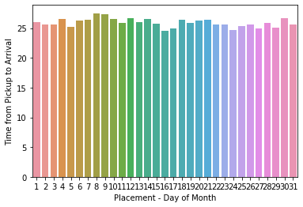
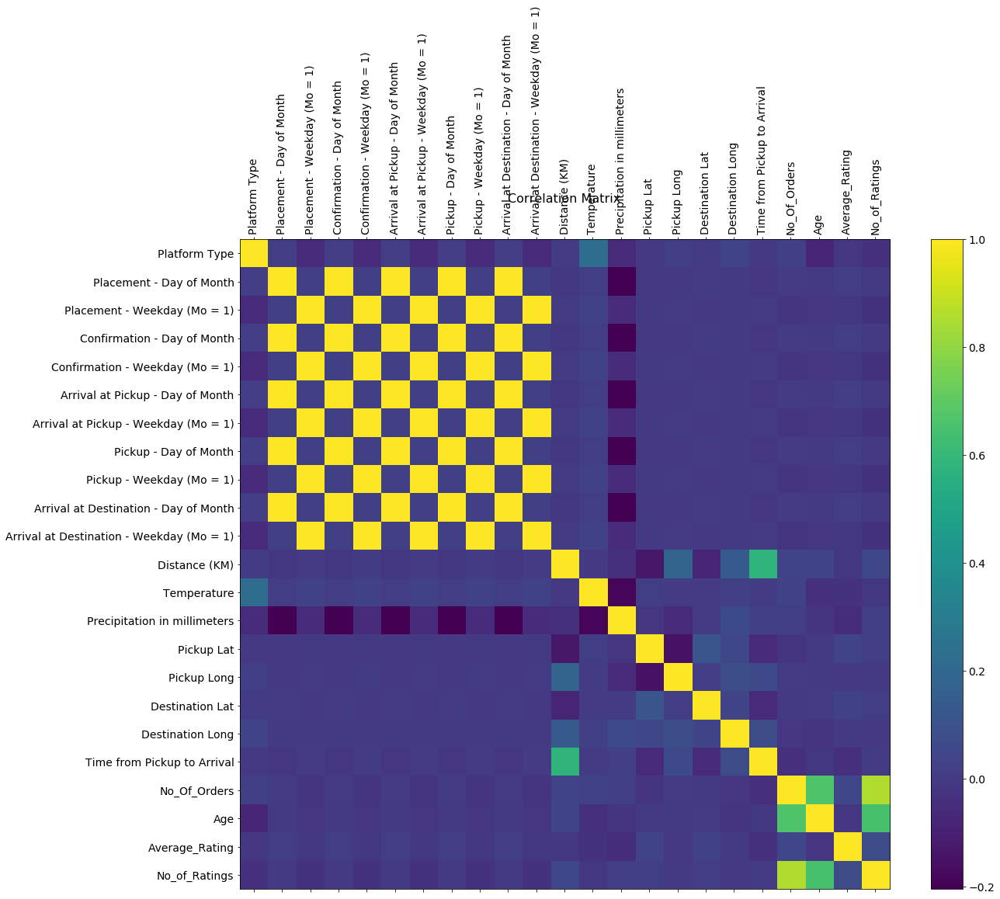
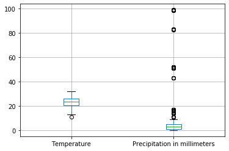
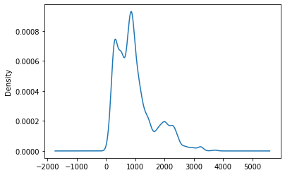
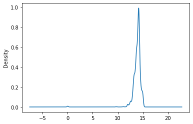
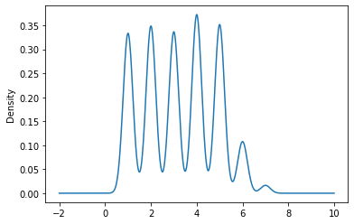

# PROJECT 2

## Importing Libraries  


```python
import numpy as np
import pandas as pd
import matplotlib.pyplot as plt
import seaborn as sns
%matplotlib inline
```

##  Loading Datasets   


```python
Train_Data=pd.read_csv("C:\\Users\\me\\Downloads\\Train.csv")
Riders_Data=pd.read_csv("C:\\Users\\me\\Downloads\\Riders.csv")
```

## Merging Datasets 


```python
Complete_Dataset=Train_Data.merge(Riders_Data, on='Rider Id')
```


```python
Complete_Dataset.head()
```


<div>
<style scoped>
    .dataframe tbody tr th:only-of-type {
        vertical-align: middle;
    }

    .dataframe tbody tr th {
        vertical-align: top;
    }

    .dataframe thead th {
        text-align: right;
    }
</style>
<table border="1" class="dataframe">
  <thead>
    <tr style="text-align: right;">
      <th></th>
      <th>Order No</th>
      <th>User Id</th>
      <th>Vehicle Type</th>
      <th>Platform Type</th>
      <th>Personal or Business</th>
      <th>Placement - Day of Month</th>
      <th>Placement - Weekday (Mo = 1)</th>
      <th>Placement - Time</th>
      <th>Confirmation - Day of Month</th>
      <th>Confirmation - Weekday (Mo = 1)</th>
      <th>...</th>
      <th>Pickup Lat</th>
      <th>Pickup Long</th>
      <th>Destination Lat</th>
      <th>Destination Long</th>
      <th>Rider Id</th>
      <th>Time from Pickup to Arrival</th>
      <th>No_Of_Orders</th>
      <th>Age</th>
      <th>Average_Rating</th>
      <th>No_of_Ratings</th>
    </tr>
  </thead>
  <tbody>
    <tr>
      <th>0</th>
      <td>Order_No_4211</td>
      <td>User_Id_633</td>
      <td>Bike</td>
      <td>3</td>
      <td>Business</td>
      <td>9</td>
      <td>5</td>
      <td>9:35:46 AM</td>
      <td>9</td>
      <td>5</td>
      <td>...</td>
      <td>-1.317755</td>
      <td>36.830370</td>
      <td>-1.300406</td>
      <td>36.829741</td>
      <td>Rider_Id_432</td>
      <td>745</td>
      <td>1637</td>
      <td>1309</td>
      <td>13.8</td>
      <td>549</td>
    </tr>
    <tr>
      <th>1</th>
      <td>Order_No_27440</td>
      <td>User_Id_2642</td>
      <td>Bike</td>
      <td>3</td>
      <td>Personal</td>
      <td>18</td>
      <td>5</td>
      <td>3:41:17 PM</td>
      <td>18</td>
      <td>5</td>
      <td>...</td>
      <td>-1.326774</td>
      <td>36.787807</td>
      <td>-1.356237</td>
      <td>36.904295</td>
      <td>Rider_Id_432</td>
      <td>2886</td>
      <td>1637</td>
      <td>1309</td>
      <td>13.8</td>
      <td>549</td>
    </tr>
    <tr>
      <th>2</th>
      <td>Order_No_14170</td>
      <td>User_Id_3339</td>
      <td>Bike</td>
      <td>3</td>
      <td>Business</td>
      <td>31</td>
      <td>5</td>
      <td>12:51:41 PM</td>
      <td>31</td>
      <td>5</td>
      <td>...</td>
      <td>-1.255189</td>
      <td>36.782203</td>
      <td>-1.273412</td>
      <td>36.818206</td>
      <td>Rider_Id_432</td>
      <td>2615</td>
      <td>1637</td>
      <td>1309</td>
      <td>13.8</td>
      <td>549</td>
    </tr>
    <tr>
      <th>3</th>
      <td>Order_No_21727</td>
      <td>User_Id_3523</td>
      <td>Bike</td>
      <td>3</td>
      <td>Personal</td>
      <td>2</td>
      <td>2</td>
      <td>7:12:10 AM</td>
      <td>2</td>
      <td>2</td>
      <td>...</td>
      <td>-1.290315</td>
      <td>36.757377</td>
      <td>-1.223520</td>
      <td>36.802061</td>
      <td>Rider_Id_432</td>
      <td>2986</td>
      <td>1637</td>
      <td>1309</td>
      <td>13.8</td>
      <td>549</td>
    </tr>
    <tr>
      <th>4</th>
      <td>Order_No_8301</td>
      <td>User_Id_87</td>
      <td>Bike</td>
      <td>2</td>
      <td>Personal</td>
      <td>22</td>
      <td>2</td>
      <td>10:40:58 AM</td>
      <td>22</td>
      <td>2</td>
      <td>...</td>
      <td>-1.273524</td>
      <td>36.799220</td>
      <td>-1.300431</td>
      <td>36.752427</td>
      <td>Rider_Id_432</td>
      <td>1602</td>
      <td>1637</td>
      <td>1309</td>
      <td>13.8</td>
      <td>549</td>
    </tr>
  </tbody>
</table>
<p>5 rows × 33 columns</p>
</div>


#  

## EDA 

## Grouping Data by Placement Day of Month  


```python
Placement_Day_Grouped=Complete_Dataset.groupby(['Placement - Day of Month'], as_index=False).mean()
```


```python
PDG=Placement_Day_Grouped[['Placement - Day of Month','Time from Pickup to Arrival']].sort_values('Time from Pickup to Arrival',ascending=False)
```


```python
PDG['Time from Pickup to Arrival']=PDG['Time from Pickup to Arrival']/60
```

## Graphical Representation of ETA on Various days  


```python
sns.barplot(x='Placement - Day of Month',y='Time from Pickup to Arrival',data=PDG)
```


    <matplotlib.axes._subplots.AxesSubplot at 0x2c0e4c38ac8>





### From the above data, it is obvious that the average ETA for the various placement days are not significantly different 

### Grouping Data by Placement Weekday  


```python
Placement_Weekday_Grouped=Complete_Dataset.groupby(['Placement - Weekday (Mo = 1)'], as_index=False).mean()
```


```python
PWG=Placement_Weekday_Grouped[['Placement - Weekday (Mo = 1)','Time from Pickup to Arrival']].sort_values('Time from Pickup to Arrival',ascending=False)
```

### On the average, it takes much time to deliver on orders placed on Sundays and Fridays. Placements on Mondays and Saturdays are faster. 

##  

## Grouping Data by Confirmation Day of Month


```python
Confirmation_Day_Grouped=Complete_Dataset.groupby(['Confirmation - Day of Month'], as_index=False).mean()
```


```python
CDG=Confirmation_Day_Grouped[['Confirmation - Day of Month','Time from Pickup to Arrival']].sort_values('Time from Pickup to Arrival',ascending=False)
```


```python
CDG
```


<div>
<style scoped>
    .dataframe tbody tr th:only-of-type {
        vertical-align: middle;
    }

    .dataframe tbody tr th {
        vertical-align: top;
    }

    .dataframe thead th {
        text-align: right;
    }
</style>
<table border="1" class="dataframe">
  <thead>
    <tr style="text-align: right;">
      <th></th>
      <th>Confirmation - Day of Month</th>
      <th>Time from Pickup to Arrival</th>
    </tr>
  </thead>
  <tbody>
    <tr>
      <th>7</th>
      <td>8</td>
      <td>1650.161557</td>
    </tr>
    <tr>
      <th>8</th>
      <td>9</td>
      <td>1636.578711</td>
    </tr>
    <tr>
      <th>29</th>
      <td>30</td>
      <td>1602.392157</td>
    </tr>
    <tr>
      <th>11</th>
      <td>12</td>
      <td>1596.331832</td>
    </tr>
    <tr>
      <th>9</th>
      <td>10</td>
      <td>1589.863188</td>
    </tr>
    <tr>
      <th>13</th>
      <td>14</td>
      <td>1589.348259</td>
    </tr>
    <tr>
      <th>3</th>
      <td>4</td>
      <td>1589.240572</td>
    </tr>
    <tr>
      <th>20</th>
      <td>21</td>
      <td>1587.523883</td>
    </tr>
    <tr>
      <th>6</th>
      <td>7</td>
      <td>1584.419708</td>
    </tr>
    <tr>
      <th>17</th>
      <td>18</td>
      <td>1583.092208</td>
    </tr>
    <tr>
      <th>5</th>
      <td>6</td>
      <td>1578.428212</td>
    </tr>
    <tr>
      <th>19</th>
      <td>20</td>
      <td>1578.175739</td>
    </tr>
    <tr>
      <th>0</th>
      <td>1</td>
      <td>1561.139004</td>
    </tr>
    <tr>
      <th>12</th>
      <td>13</td>
      <td>1560.205665</td>
    </tr>
    <tr>
      <th>18</th>
      <td>19</td>
      <td>1551.650255</td>
    </tr>
    <tr>
      <th>27</th>
      <td>28</td>
      <td>1550.485969</td>
    </tr>
    <tr>
      <th>10</th>
      <td>11</td>
      <td>1550.347537</td>
    </tr>
    <tr>
      <th>14</th>
      <td>15</td>
      <td>1544.060367</td>
    </tr>
    <tr>
      <th>22</th>
      <td>23</td>
      <td>1539.912966</td>
    </tr>
    <tr>
      <th>2</th>
      <td>3</td>
      <td>1537.409471</td>
    </tr>
    <tr>
      <th>1</th>
      <td>2</td>
      <td>1537.162791</td>
    </tr>
    <tr>
      <th>30</th>
      <td>31</td>
      <td>1536.421634</td>
    </tr>
    <tr>
      <th>25</th>
      <td>26</td>
      <td>1536.123631</td>
    </tr>
    <tr>
      <th>21</th>
      <td>22</td>
      <td>1532.955385</td>
    </tr>
    <tr>
      <th>24</th>
      <td>25</td>
      <td>1517.675832</td>
    </tr>
    <tr>
      <th>4</th>
      <td>5</td>
      <td>1515.706827</td>
    </tr>
    <tr>
      <th>28</th>
      <td>29</td>
      <td>1505.281752</td>
    </tr>
    <tr>
      <th>26</th>
      <td>27</td>
      <td>1494.273134</td>
    </tr>
    <tr>
      <th>16</th>
      <td>17</td>
      <td>1492.739865</td>
    </tr>
    <tr>
      <th>23</th>
      <td>24</td>
      <td>1480.967851</td>
    </tr>
    <tr>
      <th>15</th>
      <td>16</td>
      <td>1470.899115</td>
    </tr>
  </tbody>
</table>
</div>


### From the above data, it is obvious that the average ETA for the various confirmation days are not significantly different. 

### Grouping Data by Confirmation Weekday 


```python
Confirmation_Weekday_Grouped=Complete_Dataset.groupby(['Confirmation - Weekday (Mo = 1)'], as_index=False).mean()
```


```python
CWG=Confirmation_Weekday_Grouped[['Confirmation - Weekday (Mo = 1)','Time from Pickup to Arrival']].sort_values('Time from Pickup to Arrival',ascending=False)
```


```python
CWG
```


<div>
<style scoped>
    .dataframe tbody tr th:only-of-type {
        vertical-align: middle;
    }

    .dataframe tbody tr th {
        vertical-align: top;
    }

    .dataframe thead th {
        text-align: right;
    }
</style>
<table border="1" class="dataframe">
  <thead>
    <tr style="text-align: right;">
      <th></th>
      <th>Confirmation - Weekday (Mo = 1)</th>
      <th>Time from Pickup to Arrival</th>
    </tr>
  </thead>
  <tbody>
    <tr>
      <th>6</th>
      <td>7</td>
      <td>1683.032258</td>
    </tr>
    <tr>
      <th>4</th>
      <td>5</td>
      <td>1595.178813</td>
    </tr>
    <tr>
      <th>1</th>
      <td>2</td>
      <td>1590.174792</td>
    </tr>
    <tr>
      <th>2</th>
      <td>3</td>
      <td>1573.379545</td>
    </tr>
    <tr>
      <th>3</th>
      <td>4</td>
      <td>1556.176638</td>
    </tr>
    <tr>
      <th>0</th>
      <td>1</td>
      <td>1495.779303</td>
    </tr>
    <tr>
      <th>5</th>
      <td>6</td>
      <td>1445.685200</td>
    </tr>
  </tbody>
</table>
</div>


### On the average, it takes much time to deliver on orders confirmed on Sundays and Fridays. Placements on Mondays and Saturdays are faster. 

#  


```python
Pickup_Day_Grouped=Complete_Dataset.groupby(['Pickup - Day of Month'], as_index=False).mean()           
```


```python
PkDG=Pickup_Day_Grouped[['Pickup - Day of Month','Time from Pickup to Arrival']].sort_values('Time from Pickup to Arrival',ascending=False)
```


```python
PkDG
```


<div>
<style scoped>
    .dataframe tbody tr th:only-of-type {
        vertical-align: middle;
    }

    .dataframe tbody tr th {
        vertical-align: top;
    }

    .dataframe thead th {
        text-align: right;
    }
</style>
<table border="1" class="dataframe">
  <thead>
    <tr style="text-align: right;">
      <th></th>
      <th>Pickup - Day of Month</th>
      <th>Time from Pickup to Arrival</th>
    </tr>
  </thead>
  <tbody>
    <tr>
      <th>7</th>
      <td>8</td>
      <td>1650.161557</td>
    </tr>
    <tr>
      <th>8</th>
      <td>9</td>
      <td>1636.578711</td>
    </tr>
    <tr>
      <th>29</th>
      <td>30</td>
      <td>1602.392157</td>
    </tr>
    <tr>
      <th>11</th>
      <td>12</td>
      <td>1596.331832</td>
    </tr>
    <tr>
      <th>9</th>
      <td>10</td>
      <td>1589.863188</td>
    </tr>
    <tr>
      <th>13</th>
      <td>14</td>
      <td>1589.348259</td>
    </tr>
    <tr>
      <th>3</th>
      <td>4</td>
      <td>1589.240572</td>
    </tr>
    <tr>
      <th>20</th>
      <td>21</td>
      <td>1587.523883</td>
    </tr>
    <tr>
      <th>6</th>
      <td>7</td>
      <td>1584.419708</td>
    </tr>
    <tr>
      <th>17</th>
      <td>18</td>
      <td>1583.092208</td>
    </tr>
    <tr>
      <th>5</th>
      <td>6</td>
      <td>1578.428212</td>
    </tr>
    <tr>
      <th>19</th>
      <td>20</td>
      <td>1578.175739</td>
    </tr>
    <tr>
      <th>0</th>
      <td>1</td>
      <td>1561.139004</td>
    </tr>
    <tr>
      <th>12</th>
      <td>13</td>
      <td>1560.205665</td>
    </tr>
    <tr>
      <th>18</th>
      <td>19</td>
      <td>1551.650255</td>
    </tr>
    <tr>
      <th>27</th>
      <td>28</td>
      <td>1550.485969</td>
    </tr>
    <tr>
      <th>10</th>
      <td>11</td>
      <td>1550.347537</td>
    </tr>
    <tr>
      <th>14</th>
      <td>15</td>
      <td>1544.060367</td>
    </tr>
    <tr>
      <th>22</th>
      <td>23</td>
      <td>1539.912966</td>
    </tr>
    <tr>
      <th>2</th>
      <td>3</td>
      <td>1537.409471</td>
    </tr>
    <tr>
      <th>1</th>
      <td>2</td>
      <td>1537.162791</td>
    </tr>
    <tr>
      <th>30</th>
      <td>31</td>
      <td>1536.421634</td>
    </tr>
    <tr>
      <th>25</th>
      <td>26</td>
      <td>1536.123631</td>
    </tr>
    <tr>
      <th>21</th>
      <td>22</td>
      <td>1532.955385</td>
    </tr>
    <tr>
      <th>24</th>
      <td>25</td>
      <td>1517.675832</td>
    </tr>
    <tr>
      <th>4</th>
      <td>5</td>
      <td>1515.706827</td>
    </tr>
    <tr>
      <th>28</th>
      <td>29</td>
      <td>1505.281752</td>
    </tr>
    <tr>
      <th>26</th>
      <td>27</td>
      <td>1494.273134</td>
    </tr>
    <tr>
      <th>16</th>
      <td>17</td>
      <td>1492.739865</td>
    </tr>
    <tr>
      <th>23</th>
      <td>24</td>
      <td>1480.967851</td>
    </tr>
    <tr>
      <th>15</th>
      <td>16</td>
      <td>1470.899115</td>
    </tr>
  </tbody>
</table>
</div>


#  


```python
Pickup_Weekday_Grouped=Complete_Dataset.groupby(['Pickup - Weekday (Mo = 1)'], as_index=False).mean()
```


```python
PkWG=Pickup_Weekday_Grouped[['Pickup - Weekday (Mo = 1)','Time from Pickup to Arrival']].sort_values('Time from Pickup to Arrival',ascending=False)
```


```python
PkWG
```


<div>
<style scoped>
    .dataframe tbody tr th:only-of-type {
        vertical-align: middle;
    }

    .dataframe tbody tr th {
        vertical-align: top;
    }

    .dataframe thead th {
        text-align: right;
    }
</style>
<table border="1" class="dataframe">
  <thead>
    <tr style="text-align: right;">
      <th></th>
      <th>Pickup - Weekday (Mo = 1)</th>
      <th>Time from Pickup to Arrival</th>
    </tr>
  </thead>
  <tbody>
    <tr>
      <th>6</th>
      <td>7</td>
      <td>1683.032258</td>
    </tr>
    <tr>
      <th>4</th>
      <td>5</td>
      <td>1595.178813</td>
    </tr>
    <tr>
      <th>1</th>
      <td>2</td>
      <td>1590.174792</td>
    </tr>
    <tr>
      <th>2</th>
      <td>3</td>
      <td>1573.379545</td>
    </tr>
    <tr>
      <th>3</th>
      <td>4</td>
      <td>1556.176638</td>
    </tr>
    <tr>
      <th>0</th>
      <td>1</td>
      <td>1495.779303</td>
    </tr>
    <tr>
      <th>5</th>
      <td>6</td>
      <td>1445.685200</td>
    </tr>
  </tbody>
</table>
</div>


#  

## Grouping by Platform type


```python
Platform_Grouped=Complete_Dataset.groupby(['Platform Type'], as_index=False).mean()
```


```python
Platform_Type=Platform_Grouped[['Platform Type','Time from Pickup to Arrival']].sort_values('Time from Pickup to Arrival',ascending=False)
```


```python
Platform_Type
```


<div>
<style scoped>
    .dataframe tbody tr th:only-of-type {
        vertical-align: middle;
    }

    .dataframe tbody tr th {
        vertical-align: top;
    }

    .dataframe thead th {
        text-align: right;
    }
</style>
<table border="1" class="dataframe">
  <thead>
    <tr style="text-align: right;">
      <th></th>
      <th>Platform Type</th>
      <th>Time from Pickup to Arrival</th>
    </tr>
  </thead>
  <tbody>
    <tr>
      <th>3</th>
      <td>4</td>
      <td>1675.150000</td>
    </tr>
    <tr>
      <th>0</th>
      <td>1</td>
      <td>1572.799721</td>
    </tr>
    <tr>
      <th>2</th>
      <td>3</td>
      <td>1555.773402</td>
    </tr>
    <tr>
      <th>1</th>
      <td>2</td>
      <td>1540.861224</td>
    </tr>
  </tbody>
</table>
</div>


### Clients on platform 4 have their orders delivered late. Clients on platform 2 get their deliveries faster.

#  

## Grouping by Personal or Business


```python
Personal_Business_Grouped=Complete_Dataset.groupby(['Personal or Business'], as_index=False).mean()
```


```python
PBG=Personal_Business_Grouped[['Personal or Business','Time from Pickup to Arrival']].sort_values('Time from Pickup to Arrival',ascending=False)
```


```python
PBG
```


<div>
<style scoped>
    .dataframe tbody tr th:only-of-type {
        vertical-align: middle;
    }

    .dataframe tbody tr th {
        vertical-align: top;
    }

    .dataframe thead th {
        text-align: right;
    }
</style>
<table border="1" class="dataframe">
  <thead>
    <tr style="text-align: right;">
      <th></th>
      <th>Personal or Business</th>
      <th>Time from Pickup to Arrival</th>
    </tr>
  </thead>
  <tbody>
    <tr>
      <th>1</th>
      <td>Personal</td>
      <td>1585.056327</td>
    </tr>
    <tr>
      <th>0</th>
      <td>Business</td>
      <td>1550.743270</td>
    </tr>
  </tbody>
</table>
</div>


#  

Business orders are delivered faster than personal orders

## Grouping by Personal or Business for Distance 


```python
Personal_Business_Distance=Complete_Dataset.groupby(['Personal or Business'], as_index=False).mean()
```


```python
PBD=Personal_Business_Distance[['Personal or Business','Distance (KM)']].sort_values('Distance (KM)',ascending=False)
```


```python
PBD
```


<div>
<style scoped>
    .dataframe tbody tr th:only-of-type {
        vertical-align: middle;
    }

    .dataframe tbody tr th {
        vertical-align: top;
    }

    .dataframe thead th {
        text-align: right;
    }
</style>
<table border="1" class="dataframe">
  <thead>
    <tr style="text-align: right;">
      <th></th>
      <th>Personal or Business</th>
      <th>Distance (KM)</th>
    </tr>
  </thead>
  <tbody>
    <tr>
      <th>0</th>
      <td>Business</td>
      <td>9.525598</td>
    </tr>
    <tr>
      <th>1</th>
      <td>Personal</td>
      <td>9.419701</td>
    </tr>
  </tbody>
</table>
</div>


An average distance of 9.5km is covered in delivering Business orders and 9.4 for Personal orders

#  

## Correlation Matrix for Data 

Selecting only numeric data 


```python
Numeric_Data=Complete_Dataset._get_numeric_data()
Numeric_Data.head()
```


<div>
<style scoped>
    .dataframe tbody tr th:only-of-type {
        vertical-align: middle;
    }

    .dataframe tbody tr th {
        vertical-align: top;
    }

    .dataframe thead th {
        text-align: right;
    }
</style>
<table border="1" class="dataframe">
  <thead>
    <tr style="text-align: right;">
      <th></th>
      <th>Platform Type</th>
      <th>Placement - Day of Month</th>
      <th>Placement - Weekday (Mo = 1)</th>
      <th>Confirmation - Day of Month</th>
      <th>Confirmation - Weekday (Mo = 1)</th>
      <th>Arrival at Pickup - Day of Month</th>
      <th>Arrival at Pickup - Weekday (Mo = 1)</th>
      <th>Pickup - Day of Month</th>
      <th>Pickup - Weekday (Mo = 1)</th>
      <th>Arrival at Destination - Day of Month</th>
      <th>...</th>
      <th>Precipitation in millimeters</th>
      <th>Pickup Lat</th>
      <th>Pickup Long</th>
      <th>Destination Lat</th>
      <th>Destination Long</th>
      <th>Time from Pickup to Arrival</th>
      <th>No_Of_Orders</th>
      <th>Age</th>
      <th>Average_Rating</th>
      <th>No_of_Ratings</th>
    </tr>
  </thead>
  <tbody>
    <tr>
      <th>0</th>
      <td>3</td>
      <td>9</td>
      <td>5</td>
      <td>9</td>
      <td>5</td>
      <td>9</td>
      <td>5</td>
      <td>9</td>
      <td>5</td>
      <td>9</td>
      <td>...</td>
      <td>NaN</td>
      <td>-1.317755</td>
      <td>36.830370</td>
      <td>-1.300406</td>
      <td>36.829741</td>
      <td>745</td>
      <td>1637</td>
      <td>1309</td>
      <td>13.8</td>
      <td>549</td>
    </tr>
    <tr>
      <th>1</th>
      <td>3</td>
      <td>18</td>
      <td>5</td>
      <td>18</td>
      <td>5</td>
      <td>18</td>
      <td>5</td>
      <td>18</td>
      <td>5</td>
      <td>18</td>
      <td>...</td>
      <td>NaN</td>
      <td>-1.326774</td>
      <td>36.787807</td>
      <td>-1.356237</td>
      <td>36.904295</td>
      <td>2886</td>
      <td>1637</td>
      <td>1309</td>
      <td>13.8</td>
      <td>549</td>
    </tr>
    <tr>
      <th>2</th>
      <td>3</td>
      <td>31</td>
      <td>5</td>
      <td>31</td>
      <td>5</td>
      <td>31</td>
      <td>5</td>
      <td>31</td>
      <td>5</td>
      <td>31</td>
      <td>...</td>
      <td>NaN</td>
      <td>-1.255189</td>
      <td>36.782203</td>
      <td>-1.273412</td>
      <td>36.818206</td>
      <td>2615</td>
      <td>1637</td>
      <td>1309</td>
      <td>13.8</td>
      <td>549</td>
    </tr>
    <tr>
      <th>3</th>
      <td>3</td>
      <td>2</td>
      <td>2</td>
      <td>2</td>
      <td>2</td>
      <td>2</td>
      <td>2</td>
      <td>2</td>
      <td>2</td>
      <td>2</td>
      <td>...</td>
      <td>NaN</td>
      <td>-1.290315</td>
      <td>36.757377</td>
      <td>-1.223520</td>
      <td>36.802061</td>
      <td>2986</td>
      <td>1637</td>
      <td>1309</td>
      <td>13.8</td>
      <td>549</td>
    </tr>
    <tr>
      <th>4</th>
      <td>2</td>
      <td>22</td>
      <td>2</td>
      <td>22</td>
      <td>2</td>
      <td>22</td>
      <td>2</td>
      <td>22</td>
      <td>2</td>
      <td>22</td>
      <td>...</td>
      <td>NaN</td>
      <td>-1.273524</td>
      <td>36.799220</td>
      <td>-1.300431</td>
      <td>36.752427</td>
      <td>1602</td>
      <td>1637</td>
      <td>1309</td>
      <td>13.8</td>
      <td>549</td>
    </tr>
  </tbody>
</table>
<p>5 rows × 23 columns</p>
</div>


```python
Numeric_Data.corr()
```


<div>
<style scoped>
    .dataframe tbody tr th:only-of-type {
        vertical-align: middle;
    }

    .dataframe tbody tr th {
        vertical-align: top;
    }

    .dataframe thead th {
        text-align: right;
    }
</style>
<table border="1" class="dataframe">
  <thead>
    <tr style="text-align: right;">
      <th></th>
      <th>Platform Type</th>
      <th>Placement - Day of Month</th>
      <th>Placement - Weekday (Mo = 1)</th>
      <th>Confirmation - Day of Month</th>
      <th>Confirmation - Weekday (Mo = 1)</th>
      <th>Arrival at Pickup - Day of Month</th>
      <th>Arrival at Pickup - Weekday (Mo = 1)</th>
      <th>Pickup - Day of Month</th>
      <th>Pickup - Weekday (Mo = 1)</th>
      <th>Arrival at Destination - Day of Month</th>
      <th>...</th>
      <th>Precipitation in millimeters</th>
      <th>Pickup Lat</th>
      <th>Pickup Long</th>
      <th>Destination Lat</th>
      <th>Destination Long</th>
      <th>Time from Pickup to Arrival</th>
      <th>No_Of_Orders</th>
      <th>Age</th>
      <th>Average_Rating</th>
      <th>No_of_Ratings</th>
    </tr>
  </thead>
  <tbody>
    <tr>
      <th>Platform Type</th>
      <td>1.000000</td>
      <td>0.012764</td>
      <td>-0.058038</td>
      <td>0.012770</td>
      <td>-0.058005</td>
      <td>0.012770</td>
      <td>-0.058005</td>
      <td>0.012770</td>
      <td>-0.058005</td>
      <td>0.012770</td>
      <td>...</td>
      <td>-0.055948</td>
      <td>-0.002742</td>
      <td>0.021327</td>
      <td>0.006319</td>
      <td>0.043924</td>
      <td>-0.003827</td>
      <td>0.024060</td>
      <td>-0.074029</td>
      <td>-0.014664</td>
      <td>-0.031886</td>
    </tr>
    <tr>
      <th>Placement - Day of Month</th>
      <td>0.012764</td>
      <td>1.000000</td>
      <td>0.026148</td>
      <td>0.999998</td>
      <td>0.026122</td>
      <td>0.999998</td>
      <td>0.026122</td>
      <td>0.999998</td>
      <td>0.026122</td>
      <td>0.999998</td>
      <td>...</td>
      <td>-0.204143</td>
      <td>-0.004929</td>
      <td>-0.005453</td>
      <td>0.007541</td>
      <td>0.002077</td>
      <td>-0.014710</td>
      <td>0.008096</td>
      <td>-0.000107</td>
      <td>0.012790</td>
      <td>-0.001709</td>
    </tr>
    <tr>
      <th>Placement - Weekday (Mo = 1)</th>
      <td>-0.058038</td>
      <td>0.026148</td>
      <td>1.000000</td>
      <td>0.026132</td>
      <td>0.999952</td>
      <td>0.026132</td>
      <td>0.999952</td>
      <td>0.026132</td>
      <td>0.999952</td>
      <td>0.026132</td>
      <td>...</td>
      <td>-0.050592</td>
      <td>-0.000918</td>
      <td>0.011008</td>
      <td>-0.004299</td>
      <td>-0.000875</td>
      <td>0.009693</td>
      <td>-0.024226</td>
      <td>-0.015475</td>
      <td>-0.006834</td>
      <td>-0.025747</td>
    </tr>
    <tr>
      <th>Confirmation - Day of Month</th>
      <td>0.012770</td>
      <td>0.999998</td>
      <td>0.026132</td>
      <td>1.000000</td>
      <td>0.026123</td>
      <td>1.000000</td>
      <td>0.026123</td>
      <td>1.000000</td>
      <td>0.026123</td>
      <td>1.000000</td>
      <td>...</td>
      <td>-0.204143</td>
      <td>-0.004923</td>
      <td>-0.005448</td>
      <td>0.007550</td>
      <td>0.002073</td>
      <td>-0.014701</td>
      <td>0.008099</td>
      <td>-0.000114</td>
      <td>0.012796</td>
      <td>-0.001712</td>
    </tr>
    <tr>
      <th>Confirmation - Weekday (Mo = 1)</th>
      <td>-0.058005</td>
      <td>0.026122</td>
      <td>0.999952</td>
      <td>0.026123</td>
      <td>1.000000</td>
      <td>0.026123</td>
      <td>1.000000</td>
      <td>0.026123</td>
      <td>1.000000</td>
      <td>0.026123</td>
      <td>...</td>
      <td>-0.050592</td>
      <td>-0.000883</td>
      <td>0.011036</td>
      <td>-0.004251</td>
      <td>-0.000900</td>
      <td>0.009744</td>
      <td>-0.024205</td>
      <td>-0.015514</td>
      <td>-0.006803</td>
      <td>-0.025768</td>
    </tr>
    <tr>
      <th>Arrival at Pickup - Day of Month</th>
      <td>0.012770</td>
      <td>0.999998</td>
      <td>0.026132</td>
      <td>1.000000</td>
      <td>0.026123</td>
      <td>1.000000</td>
      <td>0.026123</td>
      <td>1.000000</td>
      <td>0.026123</td>
      <td>1.000000</td>
      <td>...</td>
      <td>-0.204143</td>
      <td>-0.004923</td>
      <td>-0.005448</td>
      <td>0.007550</td>
      <td>0.002073</td>
      <td>-0.014701</td>
      <td>0.008099</td>
      <td>-0.000114</td>
      <td>0.012796</td>
      <td>-0.001712</td>
    </tr>
    <tr>
      <th>Arrival at Pickup - Weekday (Mo = 1)</th>
      <td>-0.058005</td>
      <td>0.026122</td>
      <td>0.999952</td>
      <td>0.026123</td>
      <td>1.000000</td>
      <td>0.026123</td>
      <td>1.000000</td>
      <td>0.026123</td>
      <td>1.000000</td>
      <td>0.026123</td>
      <td>...</td>
      <td>-0.050592</td>
      <td>-0.000883</td>
      <td>0.011036</td>
      <td>-0.004251</td>
      <td>-0.000900</td>
      <td>0.009744</td>
      <td>-0.024205</td>
      <td>-0.015514</td>
      <td>-0.006803</td>
      <td>-0.025768</td>
    </tr>
    <tr>
      <th>Pickup - Day of Month</th>
      <td>0.012770</td>
      <td>0.999998</td>
      <td>0.026132</td>
      <td>1.000000</td>
      <td>0.026123</td>
      <td>1.000000</td>
      <td>0.026123</td>
      <td>1.000000</td>
      <td>0.026123</td>
      <td>1.000000</td>
      <td>...</td>
      <td>-0.204143</td>
      <td>-0.004923</td>
      <td>-0.005448</td>
      <td>0.007550</td>
      <td>0.002073</td>
      <td>-0.014701</td>
      <td>0.008099</td>
      <td>-0.000114</td>
      <td>0.012796</td>
      <td>-0.001712</td>
    </tr>
    <tr>
      <th>Pickup - Weekday (Mo = 1)</th>
      <td>-0.058005</td>
      <td>0.026122</td>
      <td>0.999952</td>
      <td>0.026123</td>
      <td>1.000000</td>
      <td>0.026123</td>
      <td>1.000000</td>
      <td>0.026123</td>
      <td>1.000000</td>
      <td>0.026123</td>
      <td>...</td>
      <td>-0.050592</td>
      <td>-0.000883</td>
      <td>0.011036</td>
      <td>-0.004251</td>
      <td>-0.000900</td>
      <td>0.009744</td>
      <td>-0.024205</td>
      <td>-0.015514</td>
      <td>-0.006803</td>
      <td>-0.025768</td>
    </tr>
    <tr>
      <th>Arrival at Destination - Day of Month</th>
      <td>0.012770</td>
      <td>0.999998</td>
      <td>0.026132</td>
      <td>1.000000</td>
      <td>0.026123</td>
      <td>1.000000</td>
      <td>0.026123</td>
      <td>1.000000</td>
      <td>0.026123</td>
      <td>1.000000</td>
      <td>...</td>
      <td>-0.204143</td>
      <td>-0.004923</td>
      <td>-0.005448</td>
      <td>0.007550</td>
      <td>0.002073</td>
      <td>-0.014701</td>
      <td>0.008099</td>
      <td>-0.000114</td>
      <td>0.012796</td>
      <td>-0.001712</td>
    </tr>
    <tr>
      <th>Arrival at Destination - Weekday (Mo = 1)</th>
      <td>-0.058005</td>
      <td>0.026122</td>
      <td>0.999952</td>
      <td>0.026123</td>
      <td>1.000000</td>
      <td>0.026123</td>
      <td>1.000000</td>
      <td>0.026123</td>
      <td>1.000000</td>
      <td>0.026123</td>
      <td>...</td>
      <td>-0.050592</td>
      <td>-0.000883</td>
      <td>0.011036</td>
      <td>-0.004251</td>
      <td>-0.000900</td>
      <td>0.009744</td>
      <td>-0.024205</td>
      <td>-0.015514</td>
      <td>-0.006803</td>
      <td>-0.025768</td>
    </tr>
    <tr>
      <th>Distance (KM)</th>
      <td>0.005528</td>
      <td>-0.007585</td>
      <td>0.003582</td>
      <td>-0.007587</td>
      <td>0.003574</td>
      <td>-0.007587</td>
      <td>0.003574</td>
      <td>-0.007587</td>
      <td>0.003574</td>
      <td>-0.007587</td>
      <td>...</td>
      <td>-0.036237</td>
      <td>-0.124338</td>
      <td>0.178537</td>
      <td>-0.079366</td>
      <td>0.135397</td>
      <td>0.580608</td>
      <td>0.037186</td>
      <td>0.036239</td>
      <td>-0.008200</td>
      <td>0.051806</td>
    </tr>
    <tr>
      <th>Temperature</th>
      <td>0.225060</td>
      <td>0.013097</td>
      <td>0.031064</td>
      <td>0.013099</td>
      <td>0.031074</td>
      <td>0.013099</td>
      <td>0.031074</td>
      <td>0.013099</td>
      <td>0.031074</td>
      <td>0.013099</td>
      <td>...</td>
      <td>-0.181327</td>
      <td>0.017916</td>
      <td>0.008746</td>
      <td>0.010420</td>
      <td>0.026297</td>
      <td>0.006465</td>
      <td>0.033419</td>
      <td>-0.042714</td>
      <td>-0.028930</td>
      <td>-0.008199</td>
    </tr>
    <tr>
      <th>Precipitation in millimeters</th>
      <td>-0.055948</td>
      <td>-0.204143</td>
      <td>-0.050592</td>
      <td>-0.204143</td>
      <td>-0.050592</td>
      <td>-0.204143</td>
      <td>-0.050592</td>
      <td>-0.204143</td>
      <td>-0.050592</td>
      <td>-0.204143</td>
      <td>...</td>
      <td>1.000000</td>
      <td>-0.015388</td>
      <td>-0.060514</td>
      <td>0.009202</td>
      <td>0.067936</td>
      <td>0.024756</td>
      <td>0.020521</td>
      <td>-0.024504</td>
      <td>-0.048303</td>
      <td>0.020154</td>
    </tr>
    <tr>
      <th>Pickup Lat</th>
      <td>-0.002742</td>
      <td>-0.004929</td>
      <td>-0.000918</td>
      <td>-0.004923</td>
      <td>-0.000883</td>
      <td>-0.004923</td>
      <td>-0.000883</td>
      <td>-0.004923</td>
      <td>-0.000883</td>
      <td>-0.004923</td>
      <td>...</td>
      <td>-0.015388</td>
      <td>1.000000</td>
      <td>-0.147629</td>
      <td>0.114975</td>
      <td>0.051399</td>
      <td>-0.053823</td>
      <td>-0.018190</td>
      <td>0.002481</td>
      <td>0.043610</td>
      <td>0.019458</td>
    </tr>
    <tr>
      <th>Pickup Long</th>
      <td>0.021327</td>
      <td>-0.005453</td>
      <td>0.011008</td>
      <td>-0.005448</td>
      <td>0.011036</td>
      <td>-0.005448</td>
      <td>0.011036</td>
      <td>-0.005448</td>
      <td>0.011036</td>
      <td>-0.005448</td>
      <td>...</td>
      <td>-0.060514</td>
      <td>-0.147629</td>
      <td>1.000000</td>
      <td>0.014992</td>
      <td>0.082803</td>
      <td>0.060285</td>
      <td>0.011274</td>
      <td>-0.001656</td>
      <td>-0.001885</td>
      <td>0.002221</td>
    </tr>
    <tr>
      <th>Destination Lat</th>
      <td>0.006319</td>
      <td>0.007541</td>
      <td>-0.004299</td>
      <td>0.007550</td>
      <td>-0.004251</td>
      <td>0.007550</td>
      <td>-0.004251</td>
      <td>0.007550</td>
      <td>-0.004251</td>
      <td>0.007550</td>
      <td>...</td>
      <td>0.009202</td>
      <td>0.114975</td>
      <td>0.014992</td>
      <td>1.000000</td>
      <td>0.046767</td>
      <td>-0.061872</td>
      <td>-0.001135</td>
      <td>0.009552</td>
      <td>0.030488</td>
      <td>0.015015</td>
    </tr>
    <tr>
      <th>Destination Long</th>
      <td>0.043924</td>
      <td>0.002077</td>
      <td>-0.000875</td>
      <td>0.002073</td>
      <td>-0.000900</td>
      <td>0.002073</td>
      <td>-0.000900</td>
      <td>0.002073</td>
      <td>-0.000900</td>
      <td>0.002073</td>
      <td>...</td>
      <td>0.067936</td>
      <td>0.051399</td>
      <td>0.082803</td>
      <td>0.046767</td>
      <td>1.000000</td>
      <td>0.070425</td>
      <td>-0.013809</td>
      <td>-0.018235</td>
      <td>0.002017</td>
      <td>-0.002748</td>
    </tr>
    <tr>
      <th>Time from Pickup to Arrival</th>
      <td>-0.003827</td>
      <td>-0.014710</td>
      <td>0.009693</td>
      <td>-0.014701</td>
      <td>0.009744</td>
      <td>-0.014701</td>
      <td>0.009744</td>
      <td>-0.014701</td>
      <td>0.009744</td>
      <td>-0.014701</td>
      <td>...</td>
      <td>0.024756</td>
      <td>-0.053823</td>
      <td>0.060285</td>
      <td>-0.061872</td>
      <td>0.070425</td>
      <td>1.000000</td>
      <td>-0.041608</td>
      <td>-0.007969</td>
      <td>-0.042559</td>
      <td>0.005609</td>
    </tr>
    <tr>
      <th>No_Of_Orders</th>
      <td>0.024060</td>
      <td>0.008096</td>
      <td>-0.024226</td>
      <td>0.008099</td>
      <td>-0.024205</td>
      <td>0.008099</td>
      <td>-0.024205</td>
      <td>0.008099</td>
      <td>-0.024205</td>
      <td>0.008099</td>
      <td>...</td>
      <td>0.020521</td>
      <td>-0.018190</td>
      <td>0.011274</td>
      <td>-0.001135</td>
      <td>-0.013809</td>
      <td>-0.041608</td>
      <td>1.000000</td>
      <td>0.669036</td>
      <td>0.051375</td>
      <td>0.857918</td>
    </tr>
    <tr>
      <th>Age</th>
      <td>-0.074029</td>
      <td>-0.000107</td>
      <td>-0.015475</td>
      <td>-0.000114</td>
      <td>-0.015514</td>
      <td>-0.000114</td>
      <td>-0.015514</td>
      <td>-0.000114</td>
      <td>-0.015514</td>
      <td>-0.000114</td>
      <td>...</td>
      <td>-0.024504</td>
      <td>0.002481</td>
      <td>-0.001656</td>
      <td>0.009552</td>
      <td>-0.018235</td>
      <td>-0.007969</td>
      <td>0.669036</td>
      <td>1.000000</td>
      <td>-0.014348</td>
      <td>0.651090</td>
    </tr>
    <tr>
      <th>Average_Rating</th>
      <td>-0.014664</td>
      <td>0.012790</td>
      <td>-0.006834</td>
      <td>0.012796</td>
      <td>-0.006803</td>
      <td>0.012796</td>
      <td>-0.006803</td>
      <td>0.012796</td>
      <td>-0.006803</td>
      <td>0.012796</td>
      <td>...</td>
      <td>-0.048303</td>
      <td>0.043610</td>
      <td>-0.001885</td>
      <td>0.030488</td>
      <td>0.002017</td>
      <td>-0.042559</td>
      <td>0.051375</td>
      <td>-0.014348</td>
      <td>1.000000</td>
      <td>0.073856</td>
    </tr>
    <tr>
      <th>No_of_Ratings</th>
      <td>-0.031886</td>
      <td>-0.001709</td>
      <td>-0.025747</td>
      <td>-0.001712</td>
      <td>-0.025768</td>
      <td>-0.001712</td>
      <td>-0.025768</td>
      <td>-0.001712</td>
      <td>-0.025768</td>
      <td>-0.001712</td>
      <td>...</td>
      <td>0.020154</td>
      <td>0.019458</td>
      <td>0.002221</td>
      <td>0.015015</td>
      <td>-0.002748</td>
      <td>0.005609</td>
      <td>0.857918</td>
      <td>0.651090</td>
      <td>0.073856</td>
      <td>1.000000</td>
    </tr>
  </tbody>
</table>
<p>23 rows × 23 columns</p>
</div>


Plotting a heatmap to give a better presentation


```python
f=plt.figure(figsize=(19,15))
plt.matshow(Numeric_Data.corr(), fignum=f.number)
plt.xticks(range(Numeric_Data.shape[1]),Numeric_Data.columns,fontsize=14, rotation=90)
plt.yticks(range(Numeric_Data.shape[1]),Numeric_Data.columns,fontsize=14)
cb=plt.colorbar()
cb.ax.tick_params(labelsize=14)
plt.title('Correlation Matrix', fontsize=16)
```


    Text(0.5, 1.05, 'Correlation Matrix')





It can be seen that, placement weekday have a higher correlation with confirmation, pickup and arrival at pick up weekdays. This is same for day of month and time. Number of orders also has a high correlation with number of ratings.

#  

## Plotting a boxplot for Temperature and Precipitation


```python
Numeric_Data.boxplot(column=['Temperature','Precipitation in millimeters'])
```


    <matplotlib.axes._subplots.AxesSubplot at 0x2c0e510e358>





Precipitation has a lot of outliers with a first quartile of zero and a median less than 10. Temperature has a median above 20 and an upper quartile a little above 30.

## KDE plot for age, Average_Rating and Arrival at Destination - Weekday 


```python
Numeric_Data.Age.plot.kde()
```


    <matplotlib.axes._subplots.AxesSubplot at 0x2c0e58585f8>





```python
Numeric_Data.Average_Rating.plot.kde()
```


    <matplotlib.axes._subplots.AxesSubplot at 0x2c0e58a76d8>





```python
Numeric_Data['Arrival at Destination - Weekday (Mo = 1)'].plot.kde()
```


    <matplotlib.axes._subplots.AxesSubplot at 0x2c0e593e588>





#  

## Summary Statistics for Features 


```python
Complete_Dataset.describe(include='all').transpose()
```


<div>
<style scoped>
    .dataframe tbody tr th:only-of-type {
        vertical-align: middle;
    }

    .dataframe tbody tr th {
        vertical-align: top;
    }

    .dataframe thead th {
        text-align: right;
    }
</style>
<table border="1" class="dataframe">
  <thead>
    <tr style="text-align: right;">
      <th></th>
      <th>count</th>
      <th>unique</th>
      <th>top</th>
      <th>freq</th>
      <th>mean</th>
      <th>std</th>
      <th>min</th>
      <th>25%</th>
      <th>50%</th>
      <th>75%</th>
      <th>max</th>
    </tr>
  </thead>
  <tbody>
    <tr>
      <th>Order No</th>
      <td>21201</td>
      <td>21201</td>
      <td>Order_No_3140</td>
      <td>1</td>
      <td>NaN</td>
      <td>NaN</td>
      <td>NaN</td>
      <td>NaN</td>
      <td>NaN</td>
      <td>NaN</td>
      <td>NaN</td>
    </tr>
    <tr>
      <th>User Id</th>
      <td>21201</td>
      <td>3186</td>
      <td>User_Id_393</td>
      <td>645</td>
      <td>NaN</td>
      <td>NaN</td>
      <td>NaN</td>
      <td>NaN</td>
      <td>NaN</td>
      <td>NaN</td>
      <td>NaN</td>
    </tr>
    <tr>
      <th>Vehicle Type</th>
      <td>21201</td>
      <td>1</td>
      <td>Bike</td>
      <td>21201</td>
      <td>NaN</td>
      <td>NaN</td>
      <td>NaN</td>
      <td>NaN</td>
      <td>NaN</td>
      <td>NaN</td>
      <td>NaN</td>
    </tr>
    <tr>
      <th>Platform Type</th>
      <td>21201</td>
      <td>NaN</td>
      <td>NaN</td>
      <td>NaN</td>
      <td>2.75218</td>
      <td>0.625178</td>
      <td>1</td>
      <td>3</td>
      <td>3</td>
      <td>3</td>
      <td>4</td>
    </tr>
    <tr>
      <th>Personal or Business</th>
      <td>21201</td>
      <td>2</td>
      <td>Business</td>
      <td>17384</td>
      <td>NaN</td>
      <td>NaN</td>
      <td>NaN</td>
      <td>NaN</td>
      <td>NaN</td>
      <td>NaN</td>
      <td>NaN</td>
    </tr>
    <tr>
      <th>Placement - Day of Month</th>
      <td>21201</td>
      <td>NaN</td>
      <td>NaN</td>
      <td>NaN</td>
      <td>15.6537</td>
      <td>8.79892</td>
      <td>1</td>
      <td>8</td>
      <td>15</td>
      <td>23</td>
      <td>31</td>
    </tr>
    <tr>
      <th>Placement - Weekday (Mo = 1)</th>
      <td>21201</td>
      <td>NaN</td>
      <td>NaN</td>
      <td>NaN</td>
      <td>3.24008</td>
      <td>1.5673</td>
      <td>1</td>
      <td>2</td>
      <td>3</td>
      <td>5</td>
      <td>7</td>
    </tr>
    <tr>
      <th>Placement - Time</th>
      <td>21201</td>
      <td>15686</td>
      <td>2:57:22 PM</td>
      <td>6</td>
      <td>NaN</td>
      <td>NaN</td>
      <td>NaN</td>
      <td>NaN</td>
      <td>NaN</td>
      <td>NaN</td>
      <td>NaN</td>
    </tr>
    <tr>
      <th>Confirmation - Day of Month</th>
      <td>21201</td>
      <td>NaN</td>
      <td>NaN</td>
      <td>NaN</td>
      <td>15.6538</td>
      <td>8.79889</td>
      <td>1</td>
      <td>8</td>
      <td>15</td>
      <td>23</td>
      <td>31</td>
    </tr>
    <tr>
      <th>Confirmation - Weekday (Mo = 1)</th>
      <td>21201</td>
      <td>NaN</td>
      <td>NaN</td>
      <td>NaN</td>
      <td>3.24022</td>
      <td>1.56723</td>
      <td>1</td>
      <td>2</td>
      <td>3</td>
      <td>5</td>
      <td>7</td>
    </tr>
    <tr>
      <th>Confirmation - Time</th>
      <td>21201</td>
      <td>15742</td>
      <td>9:56:52 AM</td>
      <td>6</td>
      <td>NaN</td>
      <td>NaN</td>
      <td>NaN</td>
      <td>NaN</td>
      <td>NaN</td>
      <td>NaN</td>
      <td>NaN</td>
    </tr>
    <tr>
      <th>Arrival at Pickup - Day of Month</th>
      <td>21201</td>
      <td>NaN</td>
      <td>NaN</td>
      <td>NaN</td>
      <td>15.6538</td>
      <td>8.79889</td>
      <td>1</td>
      <td>8</td>
      <td>15</td>
      <td>23</td>
      <td>31</td>
    </tr>
    <tr>
      <th>Arrival at Pickup - Weekday (Mo = 1)</th>
      <td>21201</td>
      <td>NaN</td>
      <td>NaN</td>
      <td>NaN</td>
      <td>3.24022</td>
      <td>1.56723</td>
      <td>1</td>
      <td>2</td>
      <td>3</td>
      <td>5</td>
      <td>7</td>
    </tr>
    <tr>
      <th>Arrival at Pickup - Time</th>
      <td>21201</td>
      <td>15767</td>
      <td>2:42:41 PM</td>
      <td>6</td>
      <td>NaN</td>
      <td>NaN</td>
      <td>NaN</td>
      <td>NaN</td>
      <td>NaN</td>
      <td>NaN</td>
      <td>NaN</td>
    </tr>
    <tr>
      <th>Pickup - Day of Month</th>
      <td>21201</td>
      <td>NaN</td>
      <td>NaN</td>
      <td>NaN</td>
      <td>15.6538</td>
      <td>8.79889</td>
      <td>1</td>
      <td>8</td>
      <td>15</td>
      <td>23</td>
      <td>31</td>
    </tr>
    <tr>
      <th>Pickup - Weekday (Mo = 1)</th>
      <td>21201</td>
      <td>NaN</td>
      <td>NaN</td>
      <td>NaN</td>
      <td>3.24022</td>
      <td>1.56723</td>
      <td>1</td>
      <td>2</td>
      <td>3</td>
      <td>5</td>
      <td>7</td>
    </tr>
    <tr>
      <th>Pickup - Time</th>
      <td>21201</td>
      <td>15690</td>
      <td>2:28:10 PM</td>
      <td>6</td>
      <td>NaN</td>
      <td>NaN</td>
      <td>NaN</td>
      <td>NaN</td>
      <td>NaN</td>
      <td>NaN</td>
      <td>NaN</td>
    </tr>
    <tr>
      <th>Arrival at Destination - Day of Month</th>
      <td>21201</td>
      <td>NaN</td>
      <td>NaN</td>
      <td>NaN</td>
      <td>15.6538</td>
      <td>8.79889</td>
      <td>1</td>
      <td>8</td>
      <td>15</td>
      <td>23</td>
      <td>31</td>
    </tr>
    <tr>
      <th>Arrival at Destination - Weekday (Mo = 1)</th>
      <td>21201</td>
      <td>NaN</td>
      <td>NaN</td>
      <td>NaN</td>
      <td>3.24022</td>
      <td>1.56723</td>
      <td>1</td>
      <td>2</td>
      <td>3</td>
      <td>5</td>
      <td>7</td>
    </tr>
    <tr>
      <th>Arrival at Destination - Time</th>
      <td>21201</td>
      <td>15725</td>
      <td>3:24:03 PM</td>
      <td>7</td>
      <td>NaN</td>
      <td>NaN</td>
      <td>NaN</td>
      <td>NaN</td>
      <td>NaN</td>
      <td>NaN</td>
      <td>NaN</td>
    </tr>
    <tr>
      <th>Distance (KM)</th>
      <td>21201</td>
      <td>NaN</td>
      <td>NaN</td>
      <td>NaN</td>
      <td>9.50653</td>
      <td>5.66896</td>
      <td>1</td>
      <td>5</td>
      <td>8</td>
      <td>13</td>
      <td>49</td>
    </tr>
    <tr>
      <th>Temperature</th>
      <td>16835</td>
      <td>NaN</td>
      <td>NaN</td>
      <td>NaN</td>
      <td>23.2589</td>
      <td>3.61577</td>
      <td>11.2</td>
      <td>20.6</td>
      <td>23.5</td>
      <td>26</td>
      <td>32.1</td>
    </tr>
    <tr>
      <th>Precipitation in millimeters</th>
      <td>552</td>
      <td>NaN</td>
      <td>NaN</td>
      <td>NaN</td>
      <td>7.9058</td>
      <td>17.09</td>
      <td>0.1</td>
      <td>1.075</td>
      <td>2.9</td>
      <td>4.9</td>
      <td>99.1</td>
    </tr>
    <tr>
      <th>Pickup Lat</th>
      <td>21201</td>
      <td>NaN</td>
      <td>NaN</td>
      <td>NaN</td>
      <td>-1.28147</td>
      <td>0.0305071</td>
      <td>-1.4383</td>
      <td>-1.30092</td>
      <td>-1.2794</td>
      <td>-1.25715</td>
      <td>-1.14717</td>
    </tr>
    <tr>
      <th>Pickup Long</th>
      <td>21201</td>
      <td>NaN</td>
      <td>NaN</td>
      <td>NaN</td>
      <td>36.8113</td>
      <td>0.0374726</td>
      <td>36.6536</td>
      <td>36.7846</td>
      <td>36.807</td>
      <td>36.8297</td>
      <td>36.991</td>
    </tr>
    <tr>
      <th>Destination Lat</th>
      <td>21201</td>
      <td>NaN</td>
      <td>NaN</td>
      <td>NaN</td>
      <td>-1.28258</td>
      <td>0.0348236</td>
      <td>-1.4303</td>
      <td>-1.3012</td>
      <td>-1.28438</td>
      <td>-1.26118</td>
      <td>-1.03023</td>
    </tr>
    <tr>
      <th>Destination Long</th>
      <td>21201</td>
      <td>NaN</td>
      <td>NaN</td>
      <td>NaN</td>
      <td>36.8112</td>
      <td>0.0447206</td>
      <td>36.6066</td>
      <td>36.7857</td>
      <td>36.808</td>
      <td>36.8295</td>
      <td>37.0168</td>
    </tr>
    <tr>
      <th>Rider Id</th>
      <td>21201</td>
      <td>924</td>
      <td>Rider_Id_726</td>
      <td>247</td>
      <td>NaN</td>
      <td>NaN</td>
      <td>NaN</td>
      <td>NaN</td>
      <td>NaN</td>
      <td>NaN</td>
      <td>NaN</td>
    </tr>
    <tr>
      <th>Time from Pickup to Arrival</th>
      <td>21201</td>
      <td>NaN</td>
      <td>NaN</td>
      <td>NaN</td>
      <td>1556.92</td>
      <td>987.271</td>
      <td>1</td>
      <td>882</td>
      <td>1369</td>
      <td>2040</td>
      <td>7883</td>
    </tr>
    <tr>
      <th>No_Of_Orders</th>
      <td>21201</td>
      <td>NaN</td>
      <td>NaN</td>
      <td>NaN</td>
      <td>1692.42</td>
      <td>1574.31</td>
      <td>2</td>
      <td>557</td>
      <td>1212</td>
      <td>2311</td>
      <td>9756</td>
    </tr>
    <tr>
      <th>Age</th>
      <td>21201</td>
      <td>NaN</td>
      <td>NaN</td>
      <td>NaN</td>
      <td>984.743</td>
      <td>646.653</td>
      <td>96</td>
      <td>495</td>
      <td>872</td>
      <td>1236</td>
      <td>3764</td>
    </tr>
    <tr>
      <th>Average_Rating</th>
      <td>21201</td>
      <td>NaN</td>
      <td>NaN</td>
      <td>NaN</td>
      <td>13.8825</td>
      <td>0.916071</td>
      <td>0</td>
      <td>13.6</td>
      <td>14</td>
      <td>14.3</td>
      <td>15.2</td>
    </tr>
    <tr>
      <th>No_of_Ratings</th>
      <td>21201</td>
      <td>NaN</td>
      <td>NaN</td>
      <td>NaN</td>
      <td>341.067</td>
      <td>402.868</td>
      <td>0</td>
      <td>61</td>
      <td>161</td>
      <td>495</td>
      <td>2298</td>
    </tr>
  </tbody>
</table>
</div>


## Checking for missing values in the dataset 


```python
Complete_Dataset.isnull().sum()
```


    Order No                                         0
    User Id                                          0
    Vehicle Type                                     0
    Platform Type                                    0
    Personal or Business                             0
    Placement - Day of Month                         0
    Placement - Weekday (Mo = 1)                     0
    Placement - Time                                 0
    Confirmation - Day of Month                      0
    Confirmation - Weekday (Mo = 1)                  0
    Confirmation - Time                              0
    Arrival at Pickup - Day of Month                 0
    Arrival at Pickup - Weekday (Mo = 1)             0
    Arrival at Pickup - Time                         0
    Pickup - Day of Month                            0
    Pickup - Weekday (Mo = 1)                        0
    Pickup - Time                                    0
    Arrival at Destination - Day of Month            0
    Arrival at Destination - Weekday (Mo = 1)        0
    Arrival at Destination - Time                    0
    Distance (KM)                                    0
    Temperature                                   4366
    Precipitation in millimeters                 20649
    Pickup Lat                                       0
    Pickup Long                                      0
    Destination Lat                                  0
    Destination Long                                 0
    Rider Id                                         0
    Time from Pickup to Arrival                      0
    No_Of_Orders                                     0
    Age                                              0
    Average_Rating                                   0
    No_of_Ratings                                    0
    dtype: int64


Temperature and Precipitation have 4,366 and 20,649 missing values respectively. The remaining features has no missing values.These missing values are for continuous features

## Representing this in Percentage


```python
Complete_Dataset.isnull().mean().round(4) * 100
```


    Order No                                      0.00
    User Id                                       0.00
    Vehicle Type                                  0.00
    Platform Type                                 0.00
    Personal or Business                          0.00
    Placement - Day of Month                      0.00
    Placement - Weekday (Mo = 1)                  0.00
    Placement - Time                              0.00
    Confirmation - Day of Month                   0.00
    Confirmation - Weekday (Mo = 1)               0.00
    Confirmation - Time                           0.00
    Arrival at Pickup - Day of Month              0.00
    Arrival at Pickup - Weekday (Mo = 1)          0.00
    Arrival at Pickup - Time                      0.00
    Pickup - Day of Month                         0.00
    Pickup - Weekday (Mo = 1)                     0.00
    Pickup - Time                                 0.00
    Arrival at Destination - Day of Month         0.00
    Arrival at Destination - Weekday (Mo = 1)     0.00
    Arrival at Destination - Time                 0.00
    Distance (KM)                                 0.00
    Temperature                                  20.59
    Precipitation in millimeters                 97.40
    Pickup Lat                                    0.00
    Pickup Long                                   0.00
    Destination Lat                               0.00
    Destination Long                              0.00
    Rider Id                                      0.00
    Time from Pickup to Arrival                   0.00
    No_Of_Orders                                  0.00
    Age                                           0.00
    Average_Rating                                0.00
    No_of_Ratings                                 0.00
    dtype: float64


For Temperature, 20.59% of its observations are missing. Precipitation has 97.4% of its data missing.

Since only 21% of temperature data is missing, we will impute it with the mean. Precipitation will be dropped because using the mean of 3.7% data to replace the missing value might not give the true representation. 

## Replacing missing values in Temperature with its mean


```python
Complete_Dataset['Temperature'] = Complete_Dataset['Temperature'].fillna(Complete_Dataset['Temperature'].mean())
```

## Dropping Precipitation from dataset


```python
Complete_Dataset=Complete_Dataset.drop(['Precipitation in millimeters'],axis=True)
```

#  

## Creating New Features 

#### Making a copy of the complete dataset. The complete dataset will be needed for the regression without the new features 


```python
Data_With_New_Features = Complete_Dataset.copy()
```


```python
Data_With_New_Features.shape
```


    (21201, 32)


### Creating new feature, Placement Period of Day

Converting Placement time to a timestamp


```python
from datetime import datetime
Data_With_New_Features['Placement - Time'] = Data_With_New_Features['Placement - Time'].apply(lambda x: datetime.strptime(x,'%I:%M:%S %p'))
```

Extracting hour of timestamp


```python
Data_With_New_Features['Placement Period of day'] = Data_With_New_Features['Placement - Time'].dt.hour
```

Categorizing hours of the day into Morning, Afternoon and Evening


```python
# Create a list to store the data
P_period=[]

# Using a for loop to populate the list
for hour in Data_With_New_Features['Placement Period of day']:
    if (hour<12):
         P_period.append('Morning')
    elif (hour>12 & hour<16):
         P_period.append('Afternoon')
    else:
         P_period.append('Evening')
            
# Storing the data as a column in Data_With_New_Features
Data_With_New_Features['Placement Period of day'] = P_period
```

##  Creating Confirmation Period of Day


```python
Data_With_New_Features['Confirmation - Time'] = Data_With_New_Features['Confirmation - Time'].apply(lambda x: datetime.strptime(x,'%I:%M:%S %p'))
Data_With_New_Features['Confirmation Period of day'] = Data_With_New_Features['Confirmation - Time'].dt.hour
# Create a list to store the data
C_period=[]

# Using a for loop to populate the list
for hour in Data_With_New_Features['Confirmation Period of day']:
    if (hour<12):
         C_period.append('Morning')
    elif (hour>12 & hour<16):
         C_period.append('Afternoon')
    else:
         C_period.append('Evening')
            
# Storing the data as a column in Data_With_New_Features
Data_With_New_Features['Confirmation Period of day'] = C_period
```

## Creating Arrival at Pickup Period of Day 


```python
Data_With_New_Features['Arrival at Pickup - Time'] = Data_With_New_Features['Arrival at Pickup - Time'].apply(lambda x: datetime.strptime(x,'%I:%M:%S %p'))
Data_With_New_Features['Arrival at Pickup Period of day'] = Data_With_New_Features['Arrival at Pickup - Time'].dt.hour
# Create a list to store the data
A_period=[]

# Using a for loop to populate the list
for hour in Data_With_New_Features['Arrival at Pickup Period of day']:
    if (hour<12):
         A_period.append('Morning')
    elif (hour>12 & hour<16):
         A_period.append('Afternoon')
    else:
         A_period.append('Evening')
            
# Storing the data as a column in Data_With_New_Features
Data_With_New_Features['Arrival at Pickup Period of day'] = A_period
```

## Creating Arrival at Destination Period of Day 


```python
Data_With_New_Features['Arrival at Destination - Time'] = Data_With_New_Features['Arrival at Destination - Time'].apply(lambda x: datetime.strptime(x,'%I:%M:%S %p'))
Data_With_New_Features['Arrival at Destination Period of day'] = Data_With_New_Features['Arrival at Destination - Time'].dt.hour
# Create a list to store the data
D_period=[]

# Using a for loop to populate the list
for hour in Data_With_New_Features['Arrival at Destination Period of day']:
    if (hour<12):
         D_period.append('Morning')
    elif (hour>12 & hour<16):
         D_period.append('Afternoon')
    else:
         D_period.append('Evening')
            
# Storing the data as a column in Data_With_New_Features
Data_With_New_Features['Arrival at Destination Period of day'] = D_period
```

## Creating Pickup Period of Day


```python
Data_With_New_Features['Pickup - Time'] = Data_With_New_Features['Pickup - Time'].apply(lambda x: datetime.strptime(x,'%I:%M:%S %p'))
Data_With_New_Features['Pickup Period of day'] = Data_With_New_Features['Pickup - Time'].dt.hour
# Create a list to store the data
Pk_period=[]

# Using a for loop to populate the list
for hour in Data_With_New_Features['Pickup Period of day']:
    if (hour<12):
         Pk_period.append('Morning')
    elif (hour>12 & hour<16):
         Pk_period.append('Afternoon')
    else:
         Pk_period.append('Evening')
            
# Storing the data as a column in Data_With_New_Features
Data_With_New_Features['Pickup Period of day'] = Pk_period
```

## Categorizing days into Weekdays and Weekends for Day Variables


```python
Data_With_New_Features['Placement day'] = np.where(Data_With_New_Features['Placement - Weekday (Mo = 1)']<6, 'Weekday', 'Weekend')
Data_With_New_Features['Confirmation day'] = np.where(Data_With_New_Features['Confirmation - Weekday (Mo = 1)']<6, 'Weekday', 'Weekend')
Data_With_New_Features['Pickup day'] = np.where(Data_With_New_Features['Pickup - Weekday (Mo = 1)']<6, 'Weekday', 'Weekend')
Data_With_New_Features['Arrival at Destination day'] = np.where(Data_With_New_Features['Arrival at Destination - Weekday (Mo = 1)']<6, 'Weekday', 'Weekend')
Data_With_New_Features['Arrival at Pickup day'] = np.where(Data_With_New_Features['Arrival at Pickup - Weekday (Mo = 1)']<6, 'Weekday', 'Weekend')
```

## Computing for proximity of The Nairobi Central Business District to the Pick up and Destination points

### For Pick up point


```python
# importing geodesic from geopy 
from geopy.distance import geodesic

#Creating a column for CBD proximity and populating it with Nan
Data_With_New_Features['CBD Proximity to Pickup Point']=np.nan

# Latitude and longitude for Central Business District (Taken online)
CBD=(-1.299719,36.816097)

# Iterating through Data to compute for Distance(km)
for i, row in Data_With_New_Features.iterrows():
    Data_With_New_Features.loc[i, 'CBD Proximity to Pickup Point'] = geodesic((Data_With_New_Features.loc[i, 'Pickup Lat'],Data_With_New_Features.loc[i, 'Pickup Long']),CBD).km 
```

### For Destination


```python
# importing geodesic from geopy 
from geopy.distance import geodesic

#Creating a column for CBD proximity and populating it with Nan
Data_With_New_Features['CBD Proximity to Destination']=np.nan

# Latitude and longitude for Central Business District (Taken online)
CBD=(-1.299719,36.816097)

# Iterating through Data to compute for Distance(km)
for i, row in Data_With_New_Features.iterrows():
    Data_With_New_Features.loc[i, 'CBD Proximity to Destination'] = geodesic((Data_With_New_Features.loc[i, 'Destination Lat'],Data_With_New_Features.loc[i, 'Destination Long']),CBD).km
```

## Categorizing Temperature into favourable and unfavourable (20-29 Degree Celcius being favourable)


```python
Temp_Cat=[]

# Using a for loop to populate the list
for temp in Data_With_New_Features['Temperature']:
    if (temp>20 and temp<29):
         Temp_Cat.append('Favourable')
    else:
         Temp_Cat.append('Unfavourable')

# Storing the data as a column in Data_With_New_Features
Data_With_New_Features['Temperature Condition'] = Temp_Cat
```

## Categorizing Day of month into 1st, 2nd, 3rd and 4th week

### For Placement Day of Month 


```python
# Create a list to store the data
PDM=[]

# Using a for loop to populate the list
for day in Data_With_New_Features['Placement - Day of Month']:
    if (day>0 and day<8):
        PDM.append('Week One')        
    elif (day>7 and day<16):
        PDM.append('Week Two')
    elif (day>15 and day<24):
        PDM.append('Week Three')
    else:
        PDM.append('Week Four')
            
# Storing the data as a column in Data_With_New_Features
Data_With_New_Features['Placement Week'] = PDM
```

### For Confirmation Day of Month 


```python
# Create a list to store the data
CDM=[]

# Using a for loop to populate the list
for day in Data_With_New_Features['Confirmation - Day of Month']:
    if (day>0 and day<8):
        CDM.append('Week One')        
    elif (day>7 and day<16):
        CDM.append('Week Two')
    elif (day>15 and day<24):
        CDM.append('Week Three')
    else:
        CDM.append('Week Four')
            
# Storing the data as a column in Data_With_New_Features
Data_With_New_Features['Confirmation Week'] = CDM
```

### For Arrival at Pickup Day of Month 


```python
# Create a list to store the data
ADM=[]

# Using a for loop to populate the list
for day in Data_With_New_Features['Arrival at Pickup - Day of Month']:
    if (day>0 and day<8):
        ADM.append('Week One')        
    elif (day>7 and day<16):
        ADM.append('Week Two')
    elif (day>15 and day<24):
        ADM.append('Week Three')
    else:
        ADM.append('Week Four')
            
# Storing the data as a column in Data_With_New_Features
Data_With_New_Features['Arrival at Pickup Week'] = ADM
```

### For Pickup Day of Month 


```python
# Create a list to store the data
PkDM=[]

# Using a for loop to populate the list
for day in Data_With_New_Features['Pickup - Day of Month']:
    if (day>0 and day<8):
        PkDM.append('Week One')        
    elif (day>7 and day<16):
        PkDM.append('Week Two')
    elif (day>15 and day<24):
        PkDM.append('Week Three')
    else:
        PkDM.append('Week Four')
            
# Storing the data as a column in Data_With_New_Features
Data_With_New_Features['Pickup Week'] = PkDM
```

## For Arrival at Destination Day of Month 


```python
# Create a list to store the data
AdDM=[]

# Using a for loop to populate the list
for day in Data_With_New_Features['Arrival at Destination - Day of Month']:
    if (day>0 and day<8):
        AdDM.append('Week One')        
    elif (day>7 and day<16):
        AdDM.append('Week Two')
    elif (day>15 and day<24):
        AdDM.append('Week Three')
    else:
        AdDM.append('Week Four')
            
# Storing the data as a column in Data_With_New_Features
Data_With_New_Features['Arrival at Destination Week'] = AdDM
```

### Checking to see the average delivery time for weekdays and weekends for Placement of order


```python
Weekend_Weekday_Grouped=Data_With_New_Features.groupby(['Placement day'], as_index=False).mean()
Weekend_Weekday_Grouped[['Placement day','Time from Pickup to Arrival']].sort_values('Time from Pickup to Arrival',ascending=False)
```


<div>
<style scoped>
    .dataframe tbody tr th:only-of-type {
        vertical-align: middle;
    }

    .dataframe tbody tr th {
        vertical-align: top;
    }

    .dataframe thead th {
        text-align: right;
    }
</style>
<table border="1" class="dataframe">
  <thead>
    <tr style="text-align: right;">
      <th></th>
      <th>Placement day</th>
      <th>Time from Pickup to Arrival</th>
    </tr>
  </thead>
  <tbody>
    <tr>
      <th>0</th>
      <td>Weekday</td>
      <td>1562.609337</td>
    </tr>
    <tr>
      <th>1</th>
      <td>Weekend</td>
      <td>1477.017033</td>
    </tr>
  </tbody>
</table>
</div>


From the table above, orders placed on Weekends are delivered faster as compared to order placements made on weekdays.

## Checking to see the average delivery time for weeks of month for pick ups


```python
Pickup_Week_Grouped=Data_With_New_Features.groupby(['Pickup Week'], as_index=False).mean()
Pickup_Week_Grouped[['Pickup Week','Time from Pickup to Arrival']].sort_values('Time from Pickup to Arrival',ascending=False)
```


<div>
<style scoped>
    .dataframe tbody tr th:only-of-type {
        vertical-align: middle;
    }

    .dataframe tbody tr th {
        vertical-align: top;
    }

    .dataframe thead th {
        text-align: right;
    }
</style>
<table border="1" class="dataframe">
  <thead>
    <tr style="text-align: right;">
      <th></th>
      <th>Pickup Week</th>
      <th>Time from Pickup to Arrival</th>
    </tr>
  </thead>
  <tbody>
    <tr>
      <th>3</th>
      <td>Week Two</td>
      <td>1589.452235</td>
    </tr>
    <tr>
      <th>1</th>
      <td>Week One</td>
      <td>1558.922781</td>
    </tr>
    <tr>
      <th>2</th>
      <td>Week Three</td>
      <td>1544.737104</td>
    </tr>
    <tr>
      <th>0</th>
      <td>Week Four</td>
      <td>1529.274536</td>
    </tr>
  </tbody>
</table>
</div>


```python
Placement_Day_Period_Grouped=Data_With_New_Features.groupby(['Placement Period of day'], as_index=False).mean()
Placement_Day_Period_Grouped[['Placement Period of day','Time from Pickup to Arrival']].sort_values('Time from Pickup to Arrival',ascending=False)
```


<div>
<style scoped>
    .dataframe tbody tr th:only-of-type {
        vertical-align: middle;
    }

    .dataframe tbody tr th {
        vertical-align: top;
    }

    .dataframe thead th {
        text-align: right;
    }
</style>
<table border="1" class="dataframe">
  <thead>
    <tr style="text-align: right;">
      <th></th>
      <th>Placement Period of day</th>
      <th>Time from Pickup to Arrival</th>
    </tr>
  </thead>
  <tbody>
    <tr>
      <th>1</th>
      <td>Evening</td>
      <td>1590.595861</td>
    </tr>
    <tr>
      <th>0</th>
      <td>Afternoon</td>
      <td>1555.835951</td>
    </tr>
    <tr>
      <th>2</th>
      <td>Morning</td>
      <td>1547.357776</td>
    </tr>
  </tbody>
</table>
</div>


Orders placed in the evening are delivered later than other periods of the day. Morning orders has the least ETA.

## Regression Analysis 

### Without New Features 

#### Dropping order Id, User Id, Vehicle type, Rider Id, all time data  and all latitude and longitude data


```python
Data_without_New_Features=Complete_Dataset.drop(["Order No", "User Id","Vehicle Type","Rider Id","Placement - Time", "Confirmation - Time", "Arrival at Pickup - Time", "Pickup - Time", "Arrival at Destination - Time","Pickup Lat", "Pickup Long", "Destination Lat", "Destination Long"], axis = 1)              
```

### One hot encoding all object variables in the data without new features

##### Selecting object data for encoding 


```python
Object_Data_without_New_Features=Data_without_New_Features['Personal or Business']
```

#### Encoding Object Data 


```python
Dummies_Data_without_New_Features= pd.get_dummies(Object_Data_without_New_Features)
```


```python
Dummies_Data_without_New_Features.head()
```


<div>
<style scoped>
    .dataframe tbody tr th:only-of-type {
        vertical-align: middle;
    }

    .dataframe tbody tr th {
        vertical-align: top;
    }

    .dataframe thead th {
        text-align: right;
    }
</style>
<table border="1" class="dataframe">
  <thead>
    <tr style="text-align: right;">
      <th></th>
      <th>Business</th>
      <th>Personal</th>
    </tr>
  </thead>
  <tbody>
    <tr>
      <th>0</th>
      <td>1</td>
      <td>0</td>
    </tr>
    <tr>
      <th>1</th>
      <td>0</td>
      <td>1</td>
    </tr>
    <tr>
      <th>2</th>
      <td>1</td>
      <td>0</td>
    </tr>
    <tr>
      <th>3</th>
      <td>0</td>
      <td>1</td>
    </tr>
    <tr>
      <th>4</th>
      <td>0</td>
      <td>1</td>
    </tr>
  </tbody>
</table>
</div>


#### Merging encoded data with original data


```python
Data_without_New_Features = pd.concat([Data_without_New_Features, Dummies_Data_without_New_Features], axis=1)
```

#### Removing all object variables/features from data.

This is done because, object variables/features cannot be used in the regression model and also, it has already been encoded.


```python
Reg_Data_without_New_Features = Data_without_New_Features.select_dtypes(exclude=['object'])
```

#### Splitting data into target and independent variables 


```python
Y_Reg_Data_without_New_Features=Reg_Data_without_New_Features["Time from Pickup to Arrival"]
X_Reg_Data_without_New_Features=Reg_Data_without_New_Features.drop(['Time from Pickup to Arrival'], axis = 1)
```

#### Importing Scikit Learn Dependencies 


```python
from sklearn.model_selection import train_test_split
from sklearn.linear_model import LinearRegression
from sklearn.metrics import mean_squared_error
```

#### Splitting Data into 80% train and 20% test with a random seed of 42 


```python
x_Train, x_Test, y_Train, y_Test = train_test_split(X_Reg_Data_without_New_Features, Y_Reg_Data_without_New_Features, test_size = 0.2, random_state = 42)
```

#### Fitting regression model with train data


```python
reg=LinearRegression()
reg.fit(x_Train,y_Train)
```


    LinearRegression(copy_X=True, fit_intercept=True, n_jobs=None, normalize=False)


#### Printing Coeffiecient for each feature used in model 


```python
reg.coef_
```


    array([ 1.54372314e+01, -2.07793989e+02, -2.07045894e+02,  5.14824313e+01,
            5.22305267e+01,  5.14824313e+01,  5.22305267e+01,  5.14824313e+01,
            5.22305267e+01,  5.14824313e+01,  5.22305267e+01,  1.00401138e+02,
            3.79155296e+00, -1.06162480e-01,  9.26262985e-03, -4.25214760e+01,
            2.85842057e-01, -2.16635052e+01,  2.16635052e+01])


#### Making prediction on the test dataset


```python
y_Pred = reg.predict(x_Test) 
```

#### Calculating MSE for the model 


```python
Old_Features_Model_MSE=mean_squared_error(y_Test,y_Pred)
```


```python
Old_Features_Model_MSE
```


    623869.7209475726


#  

### Model With Engineered Features 

#### Dropping order Id, User Id, Vehicle type, Rider Id, all time data  and all latitude and longitude data 


```python
New_Features_Data=Data_With_New_Features.drop(["Order No", "User Id","Vehicle Type","Rider Id","Placement - Time", "Confirmation - Time", "Arrival at Pickup - Time", "Pickup - Time", "Arrival at Destination - Time","Pickup Lat", "Pickup Long", "Destination Lat", "Destination Long"], axis = 1)   
```

#### Selecting Object Data for Encoding


```python
Object_New_Features_Data = New_Features_Data.select_dtypes(include=['object'])
```

#### Encoding Object Variable/Features 


```python
Dummies_Object_New_Features_Data= pd.get_dummies(Object_New_Features_Data)
```

#### Joining Encoded data with original data 


```python
New_Features_Ready_Data = pd.concat([New_Features_Data, Dummies_Object_New_Features_Data], axis=1)
```

#### Excluding Object Variables 


```python
Reg_Data_with_Eng_Features = New_Features_Ready_Data.select_dtypes(exclude=['object'])
```

#### Selecting target and dependent variables 


```python
Y_Reg_Data_with_Eng_Features=Reg_Data_with_Eng_Features["Time from Pickup to Arrival"]
X_Reg_Data_with_Eng_Features=Reg_Data_with_Eng_Features.drop(['Time from Pickup to Arrival'], axis = 1)
```

#### Splitting Data into 80% train and 20% test with a random seed of 42


```python
x_Eng_Train, x_Eng_Test, y_Eng_Train, y_Eng_Test = train_test_split(X_Reg_Data_with_Eng_Features, Y_Reg_Data_with_Eng_Features, test_size = 0.2, random_state = 42)
```

#### Fittting  Model 


```python
Eng_reg=LinearRegression()
Eng_reg.fit(x_Eng_Train,y_Eng_Train)
```


    LinearRegression(copy_X=True, fit_intercept=True, n_jobs=None, normalize=False)


#### Printing Coefficients for each feature 


```python
Eng_reg.coef_
```


    array([ 1.29693666e+01,  2.22647823e+12, -2.22647823e+12,  1.94218317e+12,
            3.94407187e+12, -5.10928108e+12, -4.12534111e+11,  8.81480613e+11,
           -1.38505886e+12,  5.91390691e+10,  7.99993265e+10,  1.08403320e+02,
           -6.09814453e+00, -1.05224609e-01,  5.85937500e-03, -3.80596657e+01,
            2.81250000e-01, -1.53945312e+01, -2.38747559e+01,  4.22857753e+09,
            4.22857756e+09,  2.25024815e+09,  2.25024832e+09,  2.25024853e+09,
           -1.49856596e+09, -1.49856605e+09, -1.49856591e+09, -1.66767438e+08,
           -1.66767691e+08, -1.66767766e+08, -2.26481542e+09, -2.26481626e+09,
           -2.26481678e+09, -1.57513546e+09, -1.57513495e+09, -1.57513436e+09,
           -1.17113774e+09,  3.49328862e+09, -2.51298040e+09,  3.49328862e+09,
            4.24758613e+09,  6.90687605e+08,  4.24758613e+09,  6.90687605e+08,
            4.24758613e+09,  6.90687605e+08, -5.99090819e+08, -5.99090816e+08,
            3.72331221e+09, -1.00839076e+10,  5.83315941e+09,  6.11832123e+09,
            3.72331221e+09, -1.00839076e+10,  5.83315941e+09,  6.11832123e+09,
            7.10841990e+09, -1.03459046e+10,  9.20525576e+09,  6.54075470e+09,
            7.10841990e+09, -1.03459046e+10,  9.20525576e+09,  6.54075470e+09,
           -2.08139455e+10,  4.17091431e+10, -2.92273116e+10, -2.44686332e+10])


#### Making Prediction for test data 


```python
y_Reg_Pred = Eng_reg.predict(x_Eng_Test) 
```

####  Calculating the MSE for the engineered feature model


```python
Engineered_Features_Model_MSE=mean_squared_error(y_Eng_Test,y_Reg_Pred)
```


```python
Engineered_Features_Model_MSE
```


    586031.0319577145


After the new features were engineered, the MSE reduced from 623,869.72 to  586,031.03

#  

## Feature Selection 

Doing feature filtering to know variables which will contribute better to model

#### Importing Feature Selection Libraries 


```python
from sklearn.feature_selection import SelectKBest
from sklearn.feature_selection import chi2
```


```python
# Feature extraction
test = SelectKBest(score_func=chi2, k=10)
fit = test.fit(X_Reg_Data_with_Eng_Features, Y_Reg_Data_with_Eng_Features)

# Summarize scores
np.set_printoptions(precision=3)
fit_Score=fit.scores_
```


```python
feature_Details = pd.DataFrame([X_Reg_Data_with_Eng_Features.columns, fit_Score]).transpose()
```

#### Renaming Columns of feature details table


```python
feature_Details.columns = ['Attribute','Score']
```

#### Sorting the score of features in descending order 


```python
feature_Details.sort_values(by='Score', ascending=False)
```


<div>
<style scoped>
    .dataframe tbody tr th:only-of-type {
        vertical-align: middle;
    }

    .dataframe tbody tr th {
        vertical-align: top;
    }

    .dataframe thead th {
        text-align: right;
    }
</style>
<table border="1" class="dataframe">
  <thead>
    <tr style="text-align: right;">
      <th></th>
      <th>Attribute</th>
      <th>Score</th>
    </tr>
  </thead>
  <tbody>
    <tr>
      <th>13</th>
      <td>No_Of_Orders</td>
      <td>6.73885e+06</td>
    </tr>
    <tr>
      <th>16</th>
      <td>No_of_Ratings</td>
      <td>2.03662e+06</td>
    </tr>
    <tr>
      <th>14</th>
      <td>Age</td>
      <td>1.89515e+06</td>
    </tr>
    <tr>
      <th>11</th>
      <td>Distance (KM)</td>
      <td>42060.6</td>
    </tr>
    <tr>
      <th>9</th>
      <td>Arrival at Destination - Day of Month</td>
      <td>20114.5</td>
    </tr>
    <tr>
      <th>3</th>
      <td>Confirmation - Day of Month</td>
      <td>20114.5</td>
    </tr>
    <tr>
      <th>5</th>
      <td>Arrival at Pickup - Day of Month</td>
      <td>20114.5</td>
    </tr>
    <tr>
      <th>7</th>
      <td>Pickup - Day of Month</td>
      <td>20114.5</td>
    </tr>
    <tr>
      <th>1</th>
      <td>Placement - Day of Month</td>
      <td>20114.1</td>
    </tr>
    <tr>
      <th>18</th>
      <td>CBD Proximity to Destination</td>
      <td>18014.8</td>
    </tr>
    <tr>
      <th>17</th>
      <td>CBD Proximity to Pickup Point</td>
      <td>10742.6</td>
    </tr>
    <tr>
      <th>34</th>
      <td>Pickup Period of day_Evening</td>
      <td>3653.96</td>
    </tr>
    <tr>
      <th>41</th>
      <td>Pickup day_Weekend</td>
      <td>3633.28</td>
    </tr>
    <tr>
      <th>37</th>
      <td>Placement day_Weekend</td>
      <td>3633.28</td>
    </tr>
    <tr>
      <th>39</th>
      <td>Confirmation day_Weekend</td>
      <td>3633.28</td>
    </tr>
    <tr>
      <th>43</th>
      <td>Arrival at Destination day_Weekend</td>
      <td>3633.28</td>
    </tr>
    <tr>
      <th>45</th>
      <td>Arrival at Pickup day_Weekend</td>
      <td>3633.28</td>
    </tr>
    <tr>
      <th>25</th>
      <td>Confirmation Period of day_Evening</td>
      <td>3612.39</td>
    </tr>
    <tr>
      <th>28</th>
      <td>Arrival at Pickup Period of day_Evening</td>
      <td>3602.97</td>
    </tr>
    <tr>
      <th>31</th>
      <td>Arrival at Destination Period of day_Evening</td>
      <td>3579.16</td>
    </tr>
    <tr>
      <th>22</th>
      <td>Placement Period of day_Evening</td>
      <td>3573.92</td>
    </tr>
    <tr>
      <th>20</th>
      <td>Personal or Business_Personal</td>
      <td>3288.97</td>
    </tr>
    <tr>
      <th>47</th>
      <td>Temperature Condition_Unfavourable</td>
      <td>3114.5</td>
    </tr>
    <tr>
      <th>53</th>
      <td>Confirmation Week_Week One</td>
      <td>3109.31</td>
    </tr>
    <tr>
      <th>61</th>
      <td>Pickup Week_Week One</td>
      <td>3109.31</td>
    </tr>
    <tr>
      <th>57</th>
      <td>Arrival at Pickup Week_Week One</td>
      <td>3109.31</td>
    </tr>
    <tr>
      <th>49</th>
      <td>Placement Week_Week One</td>
      <td>3109.31</td>
    </tr>
    <tr>
      <th>65</th>
      <td>Arrival at Destination Week_Week One</td>
      <td>3109.31</td>
    </tr>
    <tr>
      <th>54</th>
      <td>Confirmation Week_Week Three</td>
      <td>3104.89</td>
    </tr>
    <tr>
      <th>50</th>
      <td>Placement Week_Week Three</td>
      <td>3104.89</td>
    </tr>
    <tr>
      <th>...</th>
      <td>...</td>
      <td>...</td>
    </tr>
    <tr>
      <th>10</th>
      <td>Arrival at Destination - Weekday (Mo = 1)</td>
      <td>3044.33</td>
    </tr>
    <tr>
      <th>8</th>
      <td>Pickup - Weekday (Mo = 1)</td>
      <td>3044.33</td>
    </tr>
    <tr>
      <th>6</th>
      <td>Arrival at Pickup - Weekday (Mo = 1)</td>
      <td>3044.33</td>
    </tr>
    <tr>
      <th>4</th>
      <td>Confirmation - Weekday (Mo = 1)</td>
      <td>3044.33</td>
    </tr>
    <tr>
      <th>2</th>
      <td>Placement - Weekday (Mo = 1)</td>
      <td>3044.1</td>
    </tr>
    <tr>
      <th>55</th>
      <td>Confirmation Week_Week Two</td>
      <td>3009.66</td>
    </tr>
    <tr>
      <th>59</th>
      <td>Arrival at Pickup Week_Week Two</td>
      <td>3009.66</td>
    </tr>
    <tr>
      <th>63</th>
      <td>Pickup Week_Week Two</td>
      <td>3009.66</td>
    </tr>
    <tr>
      <th>51</th>
      <td>Placement Week_Week Two</td>
      <td>3009.66</td>
    </tr>
    <tr>
      <th>67</th>
      <td>Arrival at Destination Week_Week Two</td>
      <td>3009.66</td>
    </tr>
    <tr>
      <th>32</th>
      <td>Arrival at Destination Period of day_Morning</td>
      <td>2776.54</td>
    </tr>
    <tr>
      <th>35</th>
      <td>Pickup Period of day_Morning</td>
      <td>2692.86</td>
    </tr>
    <tr>
      <th>29</th>
      <td>Arrival at Pickup Period of day_Morning</td>
      <td>2591.09</td>
    </tr>
    <tr>
      <th>26</th>
      <td>Confirmation Period of day_Morning</td>
      <td>2505.69</td>
    </tr>
    <tr>
      <th>23</th>
      <td>Placement Period of day_Morning</td>
      <td>2485.52</td>
    </tr>
    <tr>
      <th>21</th>
      <td>Placement Period of day_Afternoon</td>
      <td>2204.32</td>
    </tr>
    <tr>
      <th>24</th>
      <td>Confirmation Period of day_Afternoon</td>
      <td>2122.26</td>
    </tr>
    <tr>
      <th>27</th>
      <td>Arrival at Pickup Period of day_Afternoon</td>
      <td>2006.21</td>
    </tr>
    <tr>
      <th>33</th>
      <td>Pickup Period of day_Afternoon</td>
      <td>1908.46</td>
    </tr>
    <tr>
      <th>12</th>
      <td>Temperature</td>
      <td>1768.09</td>
    </tr>
    <tr>
      <th>30</th>
      <td>Arrival at Destination Period of day_Afternoon</td>
      <td>1678.77</td>
    </tr>
    <tr>
      <th>46</th>
      <td>Temperature Condition_Favourable</td>
      <td>796.334</td>
    </tr>
    <tr>
      <th>19</th>
      <td>Personal or Business_Business</td>
      <td>722.157</td>
    </tr>
    <tr>
      <th>0</th>
      <td>Platform Type</td>
      <td>554.974</td>
    </tr>
    <tr>
      <th>15</th>
      <td>Average_Rating</td>
      <td>297.553</td>
    </tr>
    <tr>
      <th>44</th>
      <td>Arrival at Pickup day_Weekday</td>
      <td>258.654</td>
    </tr>
    <tr>
      <th>36</th>
      <td>Placement day_Weekday</td>
      <td>258.654</td>
    </tr>
    <tr>
      <th>38</th>
      <td>Confirmation day_Weekday</td>
      <td>258.654</td>
    </tr>
    <tr>
      <th>40</th>
      <td>Pickup day_Weekday</td>
      <td>258.654</td>
    </tr>
    <tr>
      <th>42</th>
      <td>Arrival at Destination day_Weekday</td>
      <td>258.654</td>
    </tr>
  </tbody>
</table>
<p>68 rows × 2 columns</p>
</div>


#  

## PCA 


```python

```
